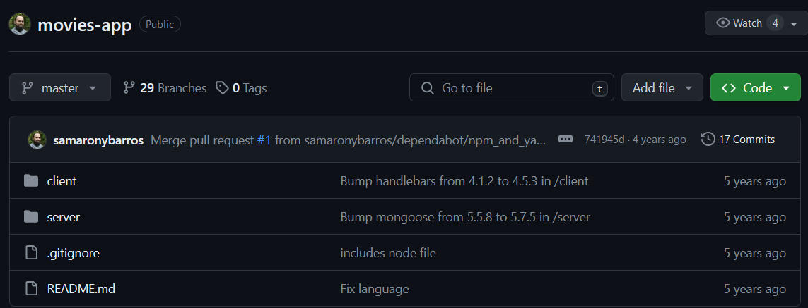

# Clout Computing

## Problem Statement:
Create any three-tier application using Docker, using a multi-container setup. Build at least one docker image using Dockerfile. You are free to use your old projects, build new projects or take any project from GitHub. However, if you are using a project from Github, properly cite the original author of the code in your blog. 

## Steps 

1. Get a sample 3-tier project. <br>
Here, I have cloned this MERN stack project from github.
``` https://github.com/samaronybarros/movies-app ```


2. After cloning, we have to create two separate ``` Dockerfile ``` for each ``` client ``` & ``` server ```. <br>
We wil use ``` docker compose ``` to create a multi-container setup.

3. Add the below code in ``` client/Dockerfile ```
    ```Dockerfile 
    FROM node:14-slim
    WORKDIR /usr/src/app 
    COPY ./package.json ./ 
    COPY ./yarn.lock ./ 
    RUN yarn install 
    COPY . . 
    EXPOSE 3000 
    CMD [ "yarn", "start" ] 
    ```
    <b>NOTE</b> remove "PORT=8000" section from start script in package.json. <br>
    it should look something like this:
    ```json
    "scripts": {
    "start": "react-scripts start",
    "build": "react-scripts build",
    "test": "react-scripts test",
    "eject": "react-scripts eject"
    },
    ```